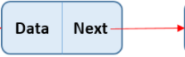
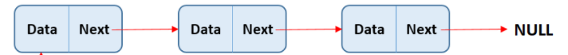
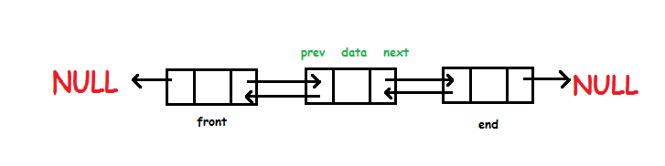
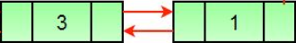
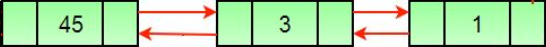
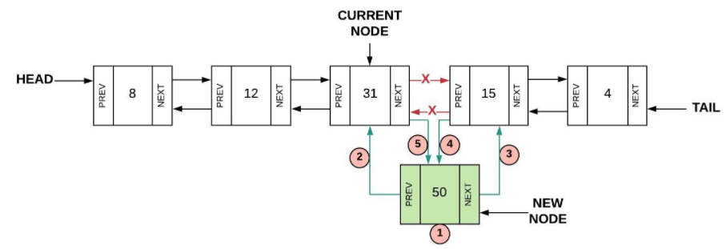
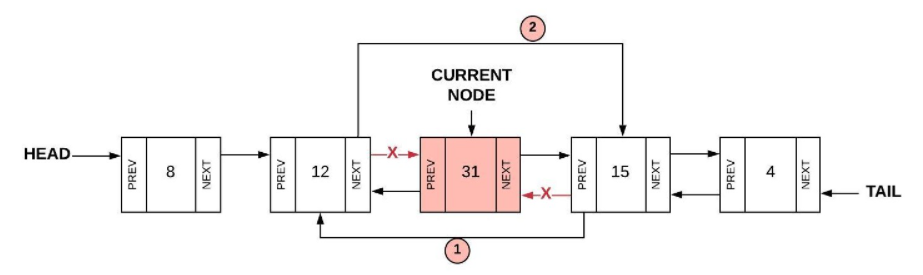
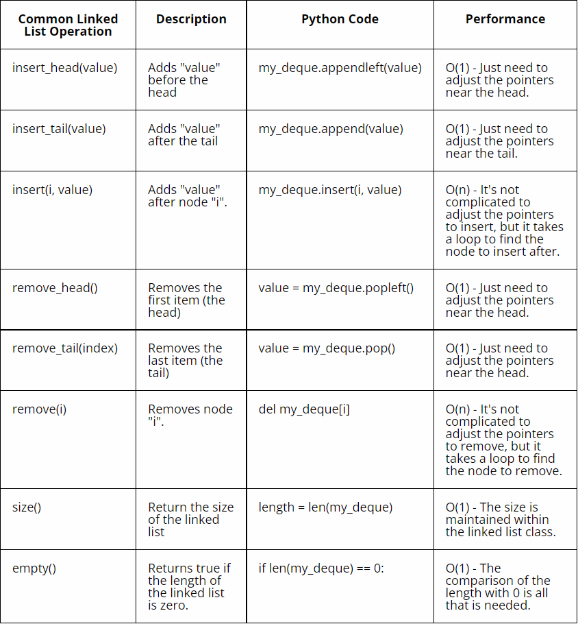

# Linked Lists

A list in python is variable length, and all of its values are stored right next to each other in memory. A linked list is like a list, but the values can be stored anywhere, randomly in memory. This means that you can not just find the fifth element of the list by doing `my_list[4]`. A linked list uses **nodes** and **links** to find the next and/or previous values. A linked list can be more efficient, especially if you are adding or removing from the head or tail of a list.

## Nodes

Nodes are connecting points in a graph. In the sense of a linked list, they contain the value at that current node, and a link to the next node, or the next node and the previous node if it is a **doubly linked list**.

A node can look something like this:



As you can see, the node contains the data, and a link to the next node. The first node in a linked list is known as the head, and the last is the tail. The tail points to **NULL** or **None**, signifying that it is the end of the linked list, until something new is added. Python uses None, so that is what I wil use to describe this.

Multiple nodes together in a linked list look like this:



This list has the first element (the head), a middle element, and the last element (the tail) which points to NULL.

A doubly linked list is similar to a singly linked list, but also has links to the node before the current node, and the head node will also point to None in its previous link, just as the tail node will point to NULL in its next link. A doubly linked list looks like this:



## Insert and Delete

As with any list, sometimes you will need to insert or delete a value from the list. The way to insert or delete is different based on if the node you are changing is at the front, back, or in the middle. For the following examples, doubly linked lists will be used.

### Empty List

if the linked list has no nodes in it, then the node that you insert will have both its previous and next pointers be None, and it will be both the head and the tail.

### Insert Front

Inserting at the front is fairly simple, and just requires that you set the next pointer to the current head of the linked list, and the previous pointer to None. In this example, the head already exists, and we are replacing it with our new node.

```python
"""Create the new node"""

# Set the new node's data
new_node.data = 45

# Set the node's next value to the list's current head
new_node.next = my_linked_list.head

# Set the new node's previous value to None
new_node.prev = None

# Set the new node to now be the current head of the list
new_node = my_linked_list.head

# Set the new head's next node's previous link to be the new head
my_linked_list.head.next.prev = my_linked_list.head 
```

The example changed the list from something like this:



To this:



### Insert Back

Inserting at the back is very similar to inserting at the front. It is the same, except you change the tail instead of the head.

```python
"""Create the new node"""

# Set the new node's data
new_node.data = 45

# Set the node's next value to None
new_node.next = None

# Set the new node's previous value to the list's current tail
new_node.prev = my_linked_list.tail

# Set the new node to now be the current tail of the list
new_node = my_linked_list.tail

# Set the new tail's next node's next link to be the new tail
my_linked_list.tail.prev.next = my_linked_list.tail 
```

The example pictures from inserting at the head are almost the same, just that the node with data 45 would be inserted at the end of the list.

### Insert Middle

Inserting at the middle is a little bit more complicated. We need to update both the node before and the node after where we want to put our new node.

```python
"""Create the new node"""

# Choose a node that you are going to insert after, usually using its data value
for node in my_linked_list:
    if node.data == 31:
        current_node = node

# Set the new node's data
new_node.data = 50

# Set the node's next value to the current node's next value
new_node.next = current_node.next

# Set the new node's previous value to the current node
new_node.prev = current_node

# Set the current node's next node's previous value to the new node
current_node.next.prev = new_node

# Set the current node's next value to the new node
current_node.next = new_node
```

This picture explains how this code works:



### Delete Front

Deleting at the front is also simple, just like inserting at the front. Basically you are just doing the exact opposite of what you did to insert at the front.

```python
# Set the head's next node's previous link to None
my_linked_list.head.next.prev = None

# Set the linked list's head to the current head's next node
my_linked_list.head = my_linked_list.head.next
```

That is all! You just have to set the head's next node's previous link to None, and then set the head to that same node that you just changed. This unattaches the current head, taking it off of the linked list.

The linked list went from this:


To this:


### Delete Back

Similar to insert back, in that it is pretty much the opposite.

```python
# Set the tail's previous node's next link to None
my_linked_list.tail.prev.next = None

# Set the linked list's tail to the current tail's next node
my_linked_list.tail = my_linked_list.tail.prev
```

It really is as simple as that! The pictures from deleting from the front are similar to deleting in the back, just that the node with data value 1 would be removed, leaving just 45 and 3.

### Delete Middle

Again, similar to insert middle, because it is basically the opposite, but requires less steps.

```python
# Choose a node that you are going to delete, usually using its data value
for node in my_linked_list:
    if node.data == 31:
        current_node = node

# Set the node's previous node's next value to the current node's next value
current_node.prev.next = current_node.next

# Set the node's next node's previous value to the current node's previous value
current_node.next.prev = current_node.prev
```

This picture explains how this works:



## Other Operations and Big O

Python does not have a built in linked list data structure, but you can use one by using a double ended queue from the deque library (`import deque`).

Some common operations that can be used on linked lists, along with their Big O are as follows:



## Common Errors

Some common errors in using linked lists include forgetting to change the pointers of the already existing nodes when adding or removing a node. This will make your linked list broken, because you may have a node in the linked list that is pointing to a node that no longer exists, or you are not pointing to a new node that now should exist in the linked list.

## Example

The following example assumes there is a linked list class that keeps track of all the nodes, the head, and the tail of the linked list.


```python
"""
Iterate through the linked list to remove the 
node with data value 3 from the linked list, 
and then print all node's data values from 
head to tail.
"""

def find_add_node(remove_data):
    # function to remove the node with the given data value.

    # sets the current node to the linked list's head node.
    curr_node = my_linked_list.head

    # while the current node's data is not equal to the data value passed in to be removed
    while curr_node.data != remove_data:
        # set the new current node to the present current node's next node.
        curr_node = curr_node.next
    
    # after the value is found, remove the node.
    curr_node.prev.next = curr_node.next
    curr_node.next.prev = curr_node.prev

def show_nodes():
    # function to print all node's data from head to tail.

    # sets the current node to the linked list's head node.
    curr_node = my_linked_list.head

    # while the current node exists
    while curr_node != None:
        # print the current node's data, and set the new current node to the present current node's next node. 
        print(curr_node.data)
        curr_node = curr_node.next

# remove node with data value 3
find_add_node(3)
# show all nodes 
show_nodes()
```

## Problem

Follow the instructions in the [assignment file](assignments/linked_list.py).

After at least attempting to solve, check your answer against a 
[possible solution](solutions/linked_list_solution.py).

[Stacks Tutorial](1-stacks.md)

[Trees Tutorial](3-trees.md)

[Return to Welcome page](0-welcome.md)