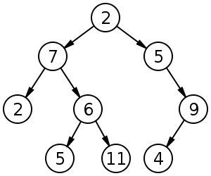
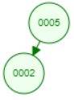
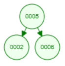
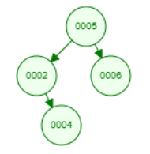
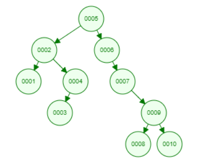
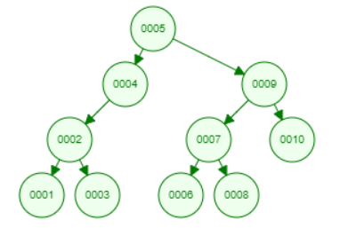
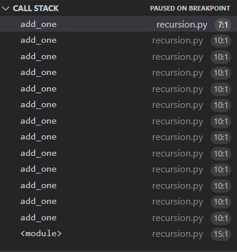
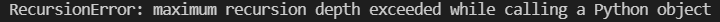
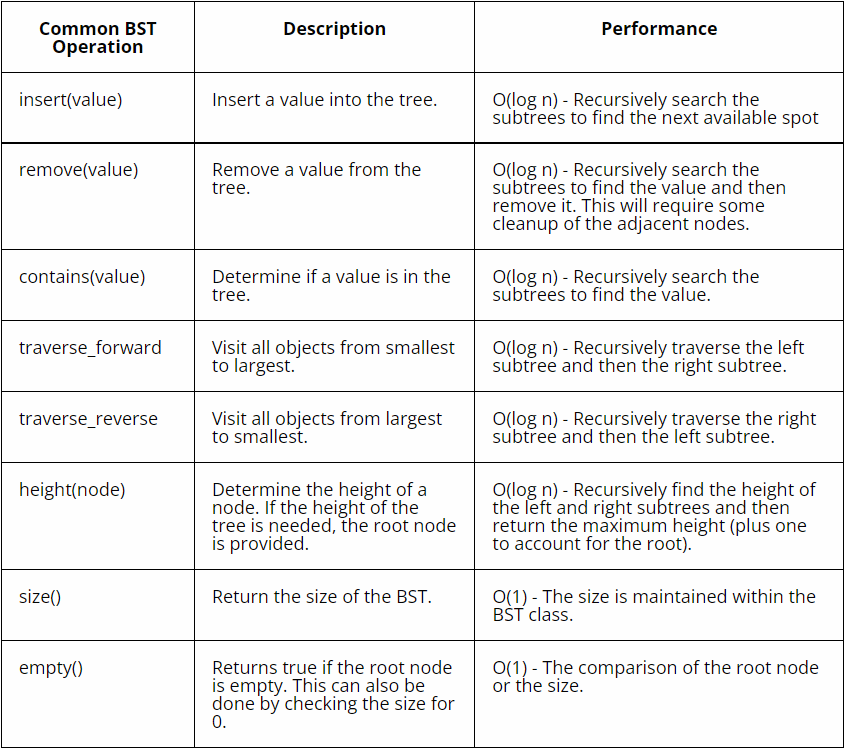
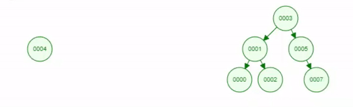

# Trees

As we all know, a tree is a plant that has a root, and then branches out and gets larger the farther up it is. This is very similar to the list data structure, but the tree is kind of turned upside down, with the root being at the top. Trees are similar to linked lists, but the difference is that each node in a tree is able to link to multiple other nodes. Trees are useful, because they can provide a way for things that are used more often to be closer to the top of the tree, and things that are used less often to be at the bottom, allowing for more efficiency. They can also be used to order stuff so that you do not have to look through every node in order to find what you are looking for, and more.

## Structure

A tree always has a starting node, known as the root. It is just a single node.


From that node, it can have any number of links/pointers to other nodes. The nodes that the current node you are looking at point to are known as the child nodes, while the current node is known as the parent node. The amount of pointers a node can have classifies what type of tree it is. In this example, each node can have two or less pointers.



As you can see, the root node **2** has a left and a right pointer. The left one, **7**, points to another **2** and a **6**. The second **2** does not have any pointers, but the **6** points to **5** and **11**. The right one, **5**, points to a **9**, which has only one pointer, pointing to **4**. *Leaf* nodes are the nodes which have no pointers. In this picture, the leaf nodes are the nodes with value 2 (the second 2, not the root node), 5, 11, and 4. 

## Binary Tree

As mentioned earlier, a tree can have any number of pointers per node. The image above is called a **binary tree**, because no node has more than 2 pointers.

A common way to implement a binary tree is in a binary search tree. When creating a binary search tree, the root node will be at the top as per usual, but all values less than the current node you are looking at will go to the left of the current node, and all values that are greater than the current node you are looking at will go to the right of the current node.

For example, if you had a root node of value 5, and wanted to add a node with value 2, then node 5 would create a left pointer to node 2. If you wanted to add a node with value 6, then node 5 would create a right pointer to node 6. If you then wanted to add a node with value 4, then you would see that it is less than 5, go along the left pointer to node 2, and then compare at that point. Since 4 is greater than 2, node 2 would create a right pointer to node 4. 
 
The image below shows this process:








Adding some more nodes, the tree could end up looking like this:



It is important to know that even if you add the some number nodes, your tree may not look the same. This is because the order that you add the nodes in may make the tree look different. Here is a tree with the same nodes as the previous, but the nodes were added in a different order:



Both trees are formatted to be binary search trees, and both have the same nodes with the same data, but they look different because of the order that the nodes were added in.

## Balanced Trees

A balanced tree is a tree in which the height of each branch of the tree differs by at most 1. The height of a tree is found by counting the number of nodes from the leaf to the root.

## Balanced Binary Search Trees

When using a binary search tree to search for a specific node that contains some data point, it is important for the tree to be balanced. Having a balanced tree allows for greater efficiency overall in finding the nodes that you are looking for, as you may have to go through less nodes before you find the one that you are looking for.

[This website](https://www.cs.usfca.edu/~galles/visualization/AVLtree.html) shows a visualization of an AVL (self-balancing) tree. 

## Recursion

Recursion is kind of similar to a loop, except instead of looping, it recalls the current function that you are in. Recursion also has a base case, which is a case in which the recursion should complete. For example, if you wanted to add 1 to a number starting at 0 until you got to 10, then you could use recursion as follows:

```python
def add_one(count):

    if count == 10: # base case
    # if count is 10, then we return the count.
        return count

    print(count) # prints the current number.

    # otherwise, we recall the add_one function and pass in count + 1.
    count = add_one(count + 1)

    # returns the final count variable, after recursion ends and makes its way back up to the first call of the add_one function.
    return count

print(add_one(0)) # prints 10, because that is the number that we use as the base case to end the recursion.
```

The above code will output:
```
0
1
2
3
4
5
6
7
8
9
10
```
From the debugger, you can see that the function calls itself, and is kept on the call stack:



Recursion in Python can be a little bit difficult, because there is a limit to how deep you can go into recursion, known as the recursion depth error:



The reason that we are learning about recursion in this tutorial is because some of the operations of trees are recursive. For example, in a binary search tree (BST), the way to know where to put a new node is by using recursion. You go down each node comparing to see if your new node's value is greater or less than the current node. You know where to put the new node because the base case checks to see if the way you are trying to create a new pointer on the current node is None, or has another node in it. If it is None, then you know to put the new node there, and exit the recursion.

## Operations and Big O

Python does not have a built in BST data structure, so these operations assume you have already created a BST in a somewhat similar way to the linked list data structure.



## Example

Once again, the following example assumes you have already created a way to keep track of a BST.

### Insert

```python
def insert(data, current_node):

    if data < current_node.data:
    # if the new node's data is less than the current node's data, go to the left.
        if current_node.left is None:
        # if the current node has a pointer to None on its left link, insert the new node with the given data.
            current_node.left = BST.Node(data)

        else:
        # recursively search with the current node's left link node.
            insert(data, current_node.left)

    else:
    # if the new node's data is greater than the current node's data, go to the right.
        if current_node.right is None:
        # if the current node has a pointer to None on its right link, insert the new node with the given data.  
            current_node.right = BST.Node(data)
        else:
        # recursively search with the current node's right link node.
            insert(data, current_node.right)


# start the insert process by passing in the data value of the new node, and the BST's root node.
insert(4, BST.root)
```

This process looks like this:



## Problem

Follow the instructions in the [assignment file](assignments/trees.py).

After at least attempting to solve, check your answer against a 
[possible solution](solutions/trees_solution.py).